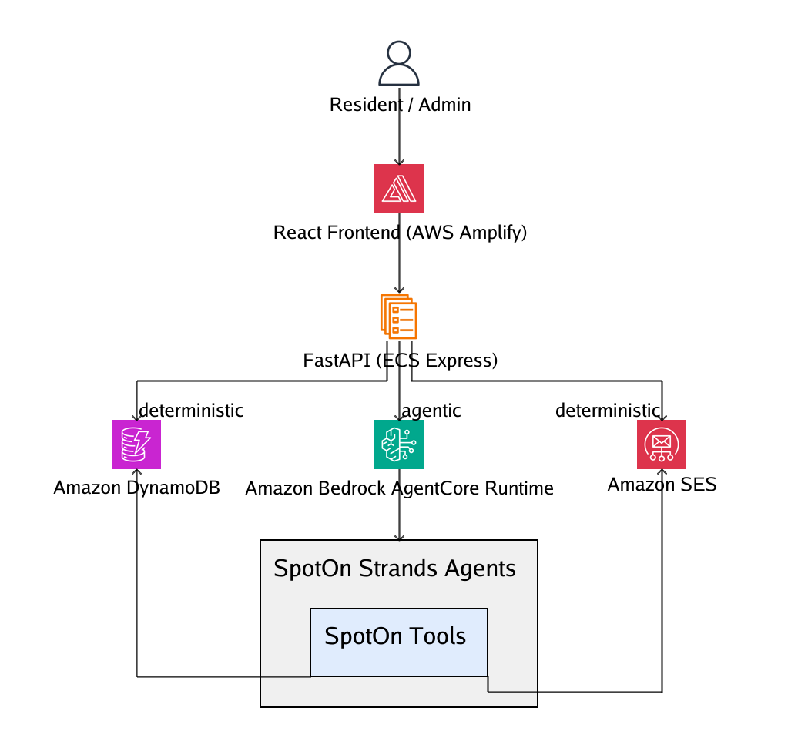

# SpotOn — Autonomous Community Parking Agent

SpotOn is an AI agent that runs visitor parking for a residential community. Residents talk to it in plain language to book visitor or temporary parking, join a waitlist when the lot is full, and release spaces early. When a space frees up, SpotOn automatically offers it to the next resident waiting. Admins report unrecognised vehicles, and SpotOn checks them against community records, while a human makes every enforcement decision.

It is built with [Strands Agents](https://strandsagents.com), runs on **Amazon Bedrock AgentCore Runtime**, and is deployed end to end on AWS.

**Live demo:** https://main.d1eyelfeh8f8tj.amplifyapp.com (resident portal at `/resident`, admin dashboard at `/admin`). It's a shared public demo with usage limits and fictional data. **Step-by-step testing instructions: [Test the live demo](#test-the-live-demo).**



## What it does

**Resident portal (`/resident`)**
- **Identifies the resident** by unit number (and first name when a unit has more than one resident). It refuses units whose parking privileges are disabled.
- **Books visitor parking** for a time window, assigns a space, and emails a confirmation.
- **Books temporary resident parking** for one of the resident's own registered vehicles.
- **Offers the waitlist** when no space is free, instead of just saying no.
- **Early release → automatic re-offer**: releasing a space offers it to the oldest waiting request that hasn't expired, and that resident can accept or decline it.
- **Live site plan** showing every space's current state.

**Admin dashboard (`/admin`)**
- **Vehicle check**: an admin reports a plate seen in a space (for example *"Unknown vehicle in V08, plate ZZZ999"*). SpotOn checks it against resident vehicles, active visitor permits and temporary permits.
- **Human review**: unmatched vehicles are flagged for review. **Mark as Expected** and **Report to Security** are explicit admin decisions, and the agent never makes them.
- **Live site plan** with capacity and review counts.

## How it works

```
React (Amplify Hosting)
   │  HTTPS / JSON
   ▼
FastAPI (Amazon ECS Express Mode)
   ├── chat routes ─────────► Amazon Bedrock AgentCore Runtime
   │                              └── Strands agents (Claude on Amazon Bedrock)
   │                                     └── tool calls ─┐
   └── deterministic routes ──────────────────────────────┤
        (release, accept/decline offer, admin decisions)  ▼
                                               Python tools & business rules
                                                  ├── Amazon DynamoDB
                                                  └── Amazon SES
```

- **The agent decides; the tools enforce.** The model chooses which tool to call and what to ask next. Eligibility, space assignment, waitlist order and plate matching are plain Python, so the rules can't be talked around.
- **One-click actions skip the model.** Releasing a space, accepting an offer and admin review decisions call the same business logic directly. They're fast and predictable, with no extra model cost.
- **Two agents, one runtime.** A resident agent and an admin agent are deployed as a single AgentCore Runtime and selected by role.
- **No AWS access from the browser.** React only talks to FastAPI. Every AWS call uses IAM roles (the ECS task role and the AgentCore execution role), never static credentials.

### Agent tools

| Agent | Tools |
|---|---|
| Resident | `identify_resident`, `check_parking_availability`, `create_permit`, `get_resident_vehicles`, `create_temporary_resident_permit`, `get_permit_status`, `join_waitlist` |
| Admin | `report_and_check_vehicle` |

## Tech stack

| Layer | Technology |
|---|---|
| Frontend | React 19 (Create React App), React Router, CSS (no UI library) — hosted on **AWS Amplify Hosting** |
| API | Python 3.13, FastAPI — container on **Amazon ECS Express Mode** (Fargate) |
| Agents | **Strands Agents** on **Amazon Bedrock AgentCore Runtime**, Claude Sonnet 4.6 via Amazon Bedrock |
| Data | **Amazon DynamoDB** (CSV repository available for local development) |
| Email | **Amazon SES** |
| Infrastructure as code | AgentCore CLI project with AWS CDK (`agentcore/`) |

## Repository layout

```
.
├── src/                          # React app
│   ├── resident/                 #   Resident portal: chat, site plan, offer banner
│   ├── admin/                    #   Admin dashboard: chat, site plan, vehicle review
│   ├── components/, pages/       #   Landing page and routes
│   └── apiBase.js                #   Backend URL (REACT_APP_API_BASE)
├── spoton_backend_app/           # Python backend
│   ├── main.py                   #   FastAPI routes
│   ├── agentcore_app.py          #   AgentCore Runtime entrypoint (thin adapter)
│   ├── agent/                    #   Resident and admin Strands agents + prompts
│   ├── tools/                    #   Tools and business rules
│   ├── repositories/             #   DynamoDB and CSV persistence
│   ├── services/                 #   AgentCore client, SES email service
│   ├── seed_dynamodb.py          #   Seeds DynamoDB from the demo CSVs
│   ├── Dockerfile                #   ECS container image
│   ├── express-primary-container.json, spoton-task-role-policy.json   # ECS config + task role policy
│   └── spoton-runtime-policy.json                                     # AgentCore execution role additions
├── agentcore/                    # AgentCore CLI project (agentcore.json, CDK)
├── mock_data.seed/               # Fictional demo data (residents, vehicles, spaces, …)
├── scripts/seed_mock_data.sh     # Resets local CSV data from mock_data.seed/
└── docs/                         # Architecture diagram, deployment notes, troubleshooting, demo test plan
```

## Running locally

**Prerequisites:** Node.js, Python 3.13 with [uv](https://docs.astral.sh/uv/), and, for the agent chat, an AWS account with a deployed AgentCore Runtime.

**Backend**
```bash
cd spoton_backend_app
cp .env.example .env        # then fill in the values below
uv sync
uv run uvicorn main:app --reload --port 8000
```

**Frontend** (in a second terminal, from the repo root)
```bash
npm install
npm start                   # http://localhost:3000, calls http://localhost:8000 by default
```

**Demo data**
```bash
./scripts/seed_mock_data.sh                                   # local CSV backend
cd spoton_backend_app && uv run python seed_dynamodb.py       # DynamoDB backend
```

### Configuration

**Backend** (`spoton_backend_app/.env` locally, container or runtime environment when deployed)

| Variable | Purpose |
|---|---|
| `SPOTON_DATA_BACKEND` | `dynamodb` or `csv` (default `csv`) |
| `SPOTON_*_TABLE` | DynamoDB table names |
| `AWS_REGION` | AWS region (default `us-east-1`) |
| `AGENTCORE_RUNTIME_ARN` | The deployed AgentCore Runtime that the chat routes invoke |
| `SPOTON_MODEL_ID` | Bedrock inference profile (default `global.anthropic.claude-sonnet-4-6`) |
| `SPOTON_SES_FROM_EMAIL`, `SPOTON_SECURITY_EMAIL` | SES sender and security-notification recipient |
| `SPOTON_EMAIL_MODE` | `live` sends through SES; `mock` logs emails instead |
| `CORS_ALLOWED_ORIGINS` | Comma-separated browser origins allowed to call the API |
| `AWS_PROFILE` | **Local only.** Never ship it to a container or runtime, which must use their IAM role. |

**Frontend**

| Variable | Purpose |
|---|---|
| `REACT_APP_API_BASE` | FastAPI base URL. It is baked into the build and public, so never put a secret here. |

## Deploying to AWS

SpotOn deploys as three independent pieces:

1. **Agents → Amazon Bedrock AgentCore Runtime.** Install the AgentCore CLI (`npm install -g @aws/agentcore`), then run `agentcore deploy` from the repo root. Runtime settings live in [`agentcore/agentcore.json`](agentcore/agentcore.json), and extra execution-role permissions in [`spoton-runtime-policy.json`](spoton_backend_app/spoton-runtime-policy.json).
2. **API → Amazon ECS Express Mode.** Build the image from `spoton_backend_app/Dockerfile`, push it to Amazon ECR, and create the Express Mode service with [`express-primary-container.json`](spoton_backend_app/express-primary-container.json) and a task role scoped by [`spoton-task-role-policy.json`](spoton_backend_app/spoton-task-role-policy.json).
3. **Frontend → AWS Amplify Hosting.** Connect the repository branch, set `REACT_APP_API_BASE` to the ECS service URL, and add the Amplify domain to the backend's `CORS_ALLOWED_ORIGINS`.

Step-by-step notes, including every deployment error hit and how it was fixed:
- [AgentCore deployment notes](docs/agentcore-deployment-notes.md) and [troubleshooting guide](docs/agentcore-troubleshooting.md)
- [ECS Express Mode deployment notes](docs/ecs-express-deployment-notes.md)
- [End-to-end demo test plan](docs/demo-smoke-test.md)

## Test the live demo

No sign-up, login or install is needed. Open **https://main.d1eyelfeh8f8tj.amplifyapp.com** in a desktop browser and type the messages below exactly as shown.

Good to know before you start:
- The **first reply can take about 10 seconds** while the agent starts; later replies take a few seconds.
- The demo is **shared**: other testers' bookings may appear on the site plan. Please release your own bookings when you're done.
- Confirmation emails are sent to the demo owner's inbox, so you won't receive them.
- **Switch Unit** (in the resident portal header, next to "SpotOn Active") appears once you've told SpotOn your unit, and starts a fresh conversation as a different resident. If you haven't identified yet, skip that click and just type the unit message.

### 1. Book visitor parking (about 2 minutes)

1. Open **https://main.d1eyelfeh8f8tj.amplifyapp.com/resident**
2. Type `Hi, I'm in unit 9`: SpotOn greets **Silvano**.
3. Type `My friend Sam is visiting tomorrow from 6 to 8 PM, plate SAM303`: SpotOn books a space, confirms the details, and the space turns **Reserved** on the site plan.
4. Click that space on the site plan, then **Release Early**: the space becomes available again.

### 2. Temporary parking for a resident's own car (about 2 minutes)

1. Click **Switch Unit**, then type `Hi, I'm in unit 14`: SpotOn greets **Netty**.
2. Type `My driveway is being repaved, I need to park my own car tomorrow from 9 AM to 5 PM`: Netty has two registered cars, so SpotOn **asks which vehicle**.
3. Type `ADM424`: SpotOn creates a temporary resident permit for that car.
4. Click the reserved space, then **Release Early** to clean up.

### 3. Rules the agent enforces (about 1 minute)

1. Click **Switch Unit**, then type `Hi, I'm in unit 6`: SpotOn explains that this unit's parking privileges are disabled and **refuses to book**.
2. Click **Switch Unit**, type `Hi, I'm in unit 99`: SpotOn asks you to double-check the unit and **doesn't invent a resident**.
3. If the site plan shows a space booked by another tester, click it, then **Release Early**: you get **"You can only change your own bookings."**

### 4. Admin: review an unknown vehicle (about 2 minutes)

1. Open **https://main.d1eyelfeh8f8tj.amplifyapp.com/admin**
2. Type `Unknown vehicle in V08, plate ZZZ999`: SpotOn finds **no matching resident vehicle or permit**, and V08 is flagged for review.
3. In the **⚠ Needs Review** strip under the site plan, click **V08**, then **Mark as Expected** or **Report to Security**: the decision is recorded and **V08 becomes available again**. SpotOn never makes this decision itself.
4. Type `Check plate ADM424 in space V04`: SpotOn **matches the plate to a registered vehicle for unit 14**, so nothing is flagged.

### 5. Optional: waitlist and automatic re-offer (about 5 minutes)

This needs a full lot, so it works best when few other people are testing.

1. On **/resident**, click **Switch Unit** and type `Hi, I'm in unit 14`.
2. Book visitors one after another (for example `My cousin Dev is visiting tomorrow from 6 to 8 PM, plate DEV101`, changing the name and plate each time) until SpotOn says **no spaces are available**.
3. When it offers the waitlist, type `Yes, please add me to the waitlist`.
4. Click one of **your** reserved spaces on the site plan, then **Release Early**: SpotOn automatically offers that space to the waitlisted request, and an **offer banner** appears. If it doesn't appear, refresh the page.
5. Click **Accept**: the space is booked for the waitlisted visitor.
6. Please release your remaining bookings when you're done.

### Quick reference

| Try | Unit / plate | Expected |
|---|---|---|
| Visitor booking | Unit **9** or **14** | Books a space and confirms it |
| Temporary parking for your own car | Unit **14** | Asks which registered vehicle (`ADM424` or `CJI606`) |
| Parking privileges disabled | Unit **6** | Politely refuses |
| Unknown unit | Unit **99** | Asks you to double-check |
| Admin: matched plate | `ADM424` | Matches a registered vehicle (unit 14) |
| Admin: unknown plate | `ZZZ999` | No match; flagged for human review |

If you see a "please try again later" message, you've hit one of the demo's usage limits; see [Public demo safeguards](#public-demo-safeguards).

## Public demo safeguards

The live demo is open to anyone, so the API protects itself instead of trusting the browser:

- **Usage limits** on agent messages (per IP, per conversation, per day in total, and concurrent calls) plus a per-IP ceiling on all API requests. The limits keep model cost bounded and are tunable through environment variables without a rebuild.
- **Ownership checks:** a booking or waitlist offer can only be released, accepted or declined from the browser session that identified as its resident.
- **Input bounds:** request body size, message length, and strict formats for ids, sessions and timezones.
- **No personal data or internals in responses:** chat responses return only a resident's first name and unit, and errors are generic (details are logged, not returned).
- **Least-privilege IAM:** the API and the agents can only reach SpotOn's six DynamoDB tables, one SES identity and one AgentCore runtime, with no delete permissions.
- **Email** only goes to verified addresses (Amazon SES sandbox).

See [the demo test plan](docs/demo-smoke-test.md#live-demo-safeguards-backend-v3) for the exact limits.

## Built with and disclosures

- **Built during the hackathon Submission Period:** first commit August 26, 2026.
- **Starter scaffolding:** the React frontend was bootstrapped with [Create React App](https://create-react-app.dev/) (`react-scripts`). The `agentcore/` folder, including its AWS CDK project, was generated by the Amazon Bedrock AgentCore CLI and then configured for SpotOn.
- **Frameworks and SDKs:** Strands Agents, Amazon Bedrock AgentCore SDK, FastAPI, boto3, React, React Router and AWS CDK. The architecture diagram is rendered with AWS Labs [diagram-as-code](https://github.com/awslabs/diagram-as-code).
- **Models and AWS services:** Claude Sonnet 4.6 on Amazon Bedrock, Amazon Bedrock AgentCore Runtime, Amazon ECS Express Mode, AWS Amplify Hosting, Amazon DynamoDB and Amazon SES.
- **AI assistance:** developed primarily with Claude Code as an AI coding assistant. The logo and landing page components were created with the help of AI generation tools.
- **Demo data:** all residents, vehicles, plates and permits are fictional, generated with [Mockaroo](https://www.mockaroo.com/).

## Prototype scope

SpotOn is a hackathon prototype. A few things are deliberately simplified:

- **Sign-in:** residents identify themselves by unit number instead of logging in, and the admin dashboard is open so you can explore it.
- **Offers:** when a space opens up, refresh the page to see a waitlist offer (there are no live push updates yet).
- **Not built yet:** permit extensions, automatic no-show release, and per-resident booking limits.

> All residents, units, vehicles, plates and permits are fictional. Please don't enter real personal information in the live demo.
